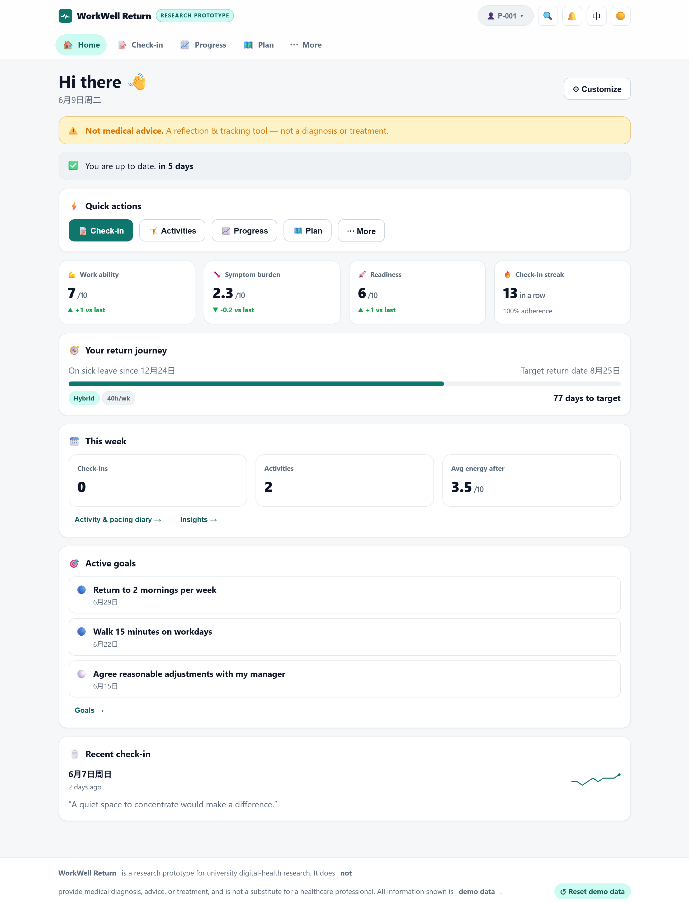
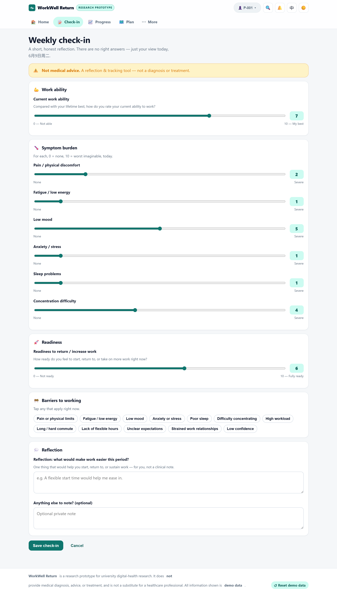
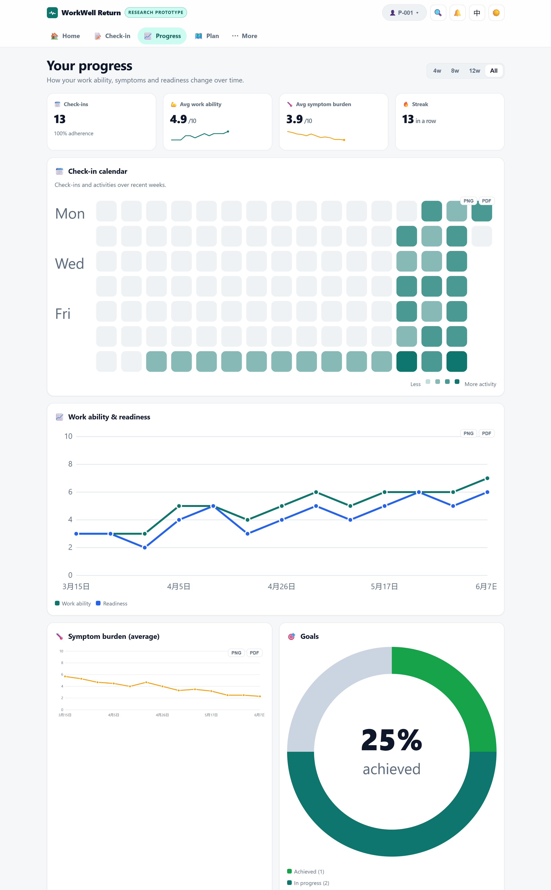
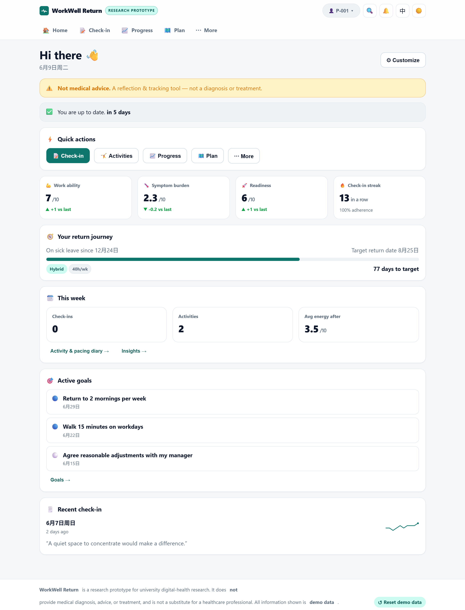
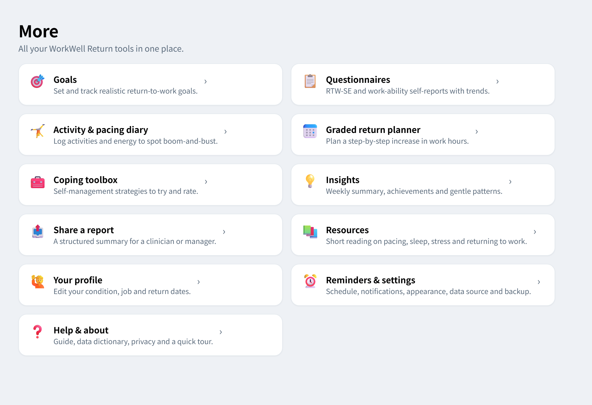
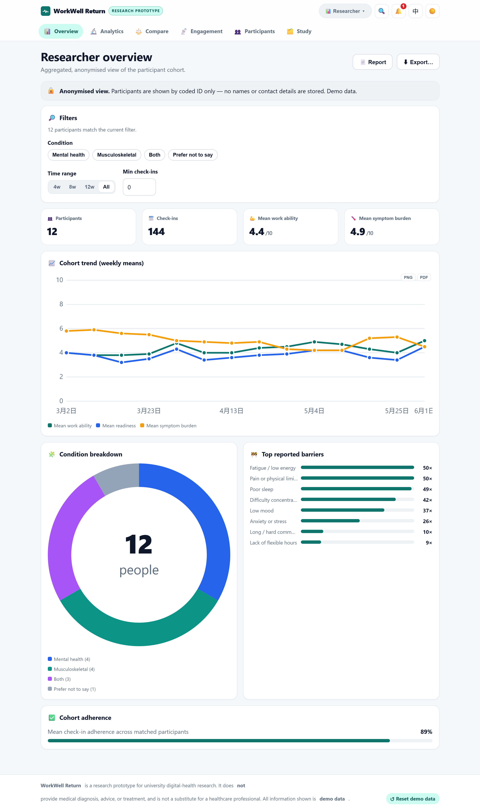
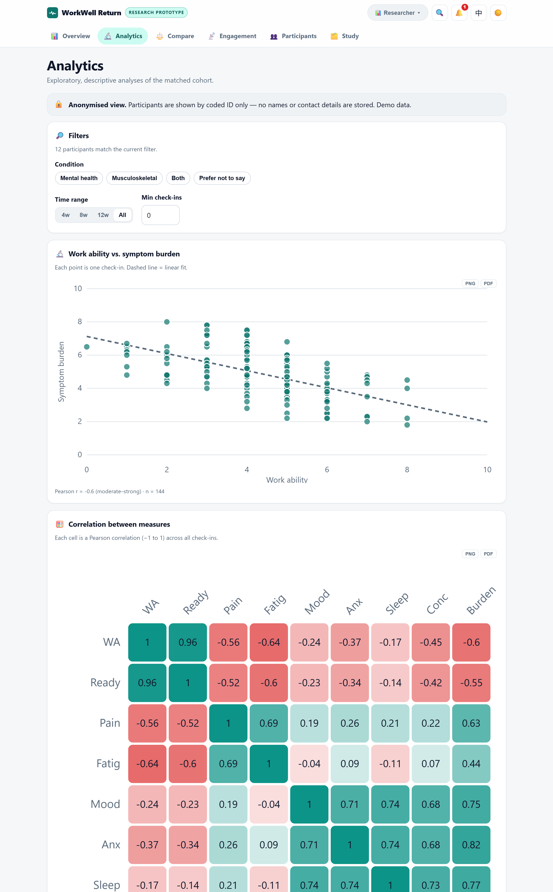
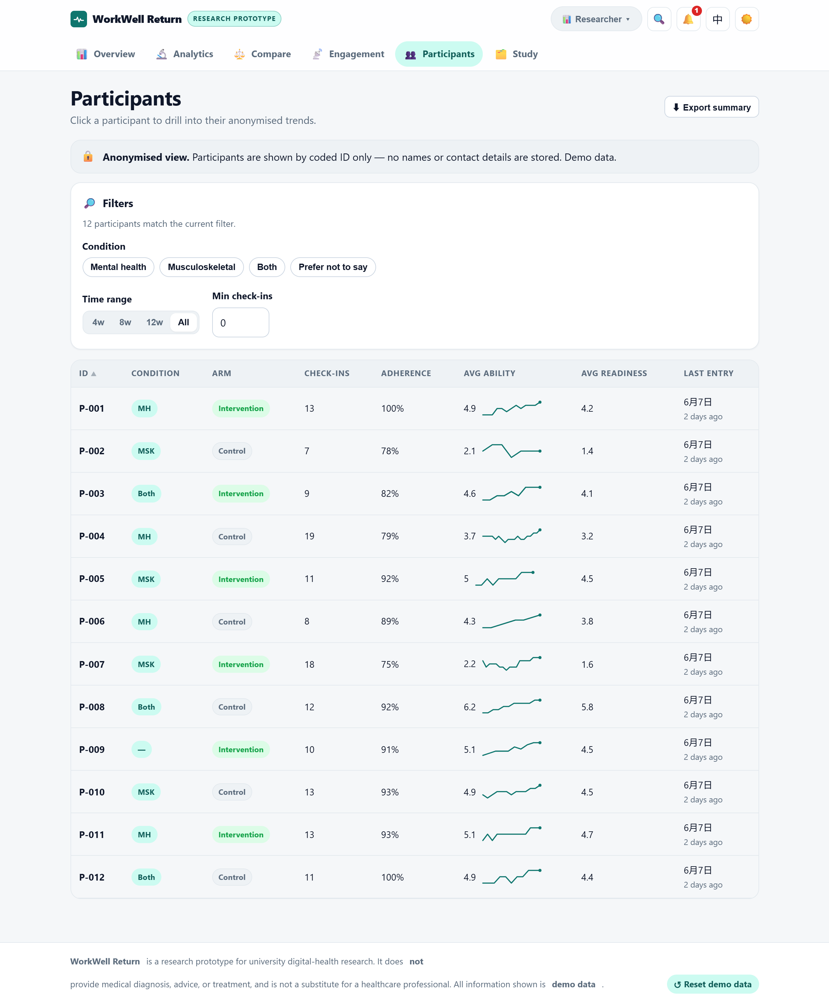

# WorkWell Return — digital health research prototype

A lightweight, **client-side** prototype that helps people on sick leave (mental-health
conditions or musculoskeletal disorders) **prepare for a sustainable return to work**.
It is a *reflection & tracking* tool plus a **researcher dashboard** — built for university
digital-health research.

> ⚠️ **Not a medical device.** WorkWell Return does **not** provide diagnosis, advice, or
> treatment. It helps users reflect on work readiness, identify barriers, set realistic goals,
> and share *structured, anonymised* information with researchers or a healthcare contact.
> **All data is synthetic demo data**, stored only in the browser (localStorage).

---

**▶ Live demo:** https://tiandaochouqin-wei.github.io/workwell-return/

## Screenshots

### Participant app

<table>
  <tr>
    <td width="50%" valign="top"><b>1 · Home</b><br/>customizable, drag-reorder dashboard<br/></td>
    <td width="50%" valign="top"><b>2 · Daily check-in</b><br/>work ability, symptom burden, readiness, barriers<br/></td>
  </tr>
  <tr>
    <td valign="top"><b>3 · Progress</b><br/>check-in calendar, work-ability &amp; symptom trends, scores<br/></td>
    <td valign="top"><b>4 · Questionnaires</b><br/>RTW-SE, WAI, PHQ-9, GAD-7, PEG with scoring &amp; trends<br/></td>
  </tr>
  <tr>
    <td colspan="2" valign="top"><b>5 · “More” hub</b> — goals, activity &amp; pacing diary, graded-return planner, coping toolbox, insights, shareable report, resources<br/></td>
  </tr>
</table>

### Researcher dashboard (anonymised)

<table>
  <tr>
    <td width="50%" valign="top"><b>6 · Overview</b><br/>cohort stats, weekly mean trends, condition breakdown, adherence<br/></td>
    <td width="50%" valign="top"><b>7 · Analytics</b><br/>regression &amp; Pearson <i>r</i>, correlation matrix, Cohen's <i>d</i><br/></td>
  </tr>
  <tr>
    <td colspan="2" valign="top"><b>8 · Participants</b><br/>sortable coded-ID table with sparklines, drill-down &amp; study-arm management<br/></td>
  </tr>
</table>

## Run it

**Option A — just open it.** Double-click `index.html`. The app uses plain scripts (no build,
no modules), so it runs straight from `file://`.

**Option B — local server** (recommended; mirrors how it would be hosted):

```bash
node server.js        # serves http://localhost:5173
```

No dependencies, no build step, no network calls.

## Deploy to GitHub Pages

The site is fully static, so hosting is free and the URL doubles as a demo link.
Make `workwell-return` its own repository, then:

```bash
cd workwell-return
git init && git add . && git commit -m "WorkWell Return prototype"
git branch -M main
git remote add origin https://github.com/<user>/<repo>.git
git push -u origin main
```

In the repo: **Settings → Pages → Build and deployment → Source: GitHub Actions**.
The included [`.github/workflows/deploy.yml`](.github/workflows/deploy.yml) publishes on every
push to `main`; your site goes live at `https://<user>.github.io/<repo>/`.
(`.nojekyll` is included so all files are served as-is.)

---

## What's inside

### Participant app
- **Onboarding wizard** — multi-step: consent, a richer profile (job role, work setup, weekly hours, sick-leave start, target return date), check-in schedule, and an optional baseline snapshot.
- **Home (Today)** — a **customizable dashboard**: show/hide and **drag-reorder** widgets (reminder, key stats, return journey, this-week, goals, recent check-in, insights, calendar). The layout is saved per participant.
- **Check-in** — work-ability rating, symptom-burden sliders, readiness, barriers checklist, reflection.
- **Progress** — dashboard of work ability, readiness, symptom burden (overall + per symptom), questionnaire scores, goal completion and top barriers over time, with range filter.
- **Action plan** — editable return-to-work plan in phases (prepare → gradual steps → review). Reflection prompts, *not* medical instructions.
- **More** hub → all secondary tools:
  - **Goals** — realistic goal setting with status and progress.
  - **Questionnaires** — five instruments with scoring, history & trends (defined in `schema.js`): **RTW-SE**, a short adapted **WAI**, **PHQ-9** and **GAD-7** (sum-scored with severity bands), and **PEG-3** pain. PHQ-9 shows a built-in **crisis-support message** if the self-harm item is endorsed.
  - **Activity & pacing diary** — log activities (type, effort, energy after); time-by-type and an effort-vs-energy scatter to spot boom-and-bust.
  - **Graded return planner** — an editable weekly-hours grid across multiple weeks, with planned-vs-actual bars (actuals come from Work activities).
  - **Coping toolbox** — a categorized strategy library; mark tried/helpful and add notes.
  - **Insights** — auto weekly summary, achievement badges, and gentle (non-diagnostic) patterns.
  - **Share a report** — a printable, structured summary for a clinician/manager, with date range, include-toggles, copy and Print/PDF.
  - **Resources** — a small psychoeducation library (pacing, sleep, stress, returning to work, support) with read-tracking. General information, not medical advice.
  - **Your profile** — edit condition, job, work setup, hours and return dates any time (auto-saved).
  - **Reminders & settings** — schedule, notifications, **data source**, **appearance** (theme/accent/**text size/high-contrast/reduce-motion**), **backup & restore**, and demo reset.
  - **Help & about** — what the tool is, a privacy summary, an on-screen **data dictionary** (instruments & scales), keyboard shortcuts, and a **guided tour**.

### Researcher view (anonymised)
- **Overview** — cohort stats, weekly mean trends, condition breakdown, top barriers, adherence. Filter by condition / time range / minimum check-ins.
- **Analytics** — work-ability-vs-symptom-burden scatter with regression & Pearson *r*, a work-ability distribution, and an intervention-vs-control table with mean difference and **Cohen’s *d*** (descriptive).
- **Compare** — group statistics **by condition or by study arm** (toggle): grouped means, per-group weekly trends, and a means ±SD table including questionnaire scores.
- **Engagement & retention** — active-participants-per-week, mean adherence, **at-risk** flags, and a per-participant engagement table.
- **Participants** — sortable table (coded IDs, condition, study arm) with sparklines; click to drill into one participant's profile, trends and full **event timeline**.
- **Study management** — assign **study arms**, **balance arms** with one click, and withdraw / re-enroll participants. Drives the “by study arm” analytics.
- **Study report** — a one-click, **print-to-PDF** full-cohort report (summary, weekly trend, condition/arm breakdown, group statistics, top barriers).
- **Export** — anonymised **CSV** / **JSON** / **survey CSV** through a dialog with a **group selector** (export all, or one condition / arm), a **date range**, a **de-identification check** (scans free-text for emails, phone numbers, URLs, long numbers — redacts or excludes), a per-participant **summary CSV**, and a **codebook CSV** documenting every variable.

Demo data includes **study arms** (intervention/control), enrollment status, and richer participant profiles to power the analytics.

### Appearance & language
- **Light / dark** theme and **five brand accents** (teal, blue, violet, green, rose) — both persisted.
- **Bilingual (English / 中文)** via `i18n.js` + a header toggle. Coverage includes the whole **participant app and the full researcher side** (page titles, cards, stat tiles, table headers, filters, buttons), the data vocabulary, and disclaimers — components auto-translate titles/labels, so adding a language is mostly dictionary work.
- **Multilingual questionnaires** — each instrument carries localized items, scales, stems and (for PHQ-9) the safety message. Chinese wording for PHQ-9 / GAD-7 / PEG / RTW-SE / WAI is included (`schema.QUESTIONNAIRE_I18N`).

### Data source (pluggable backend)
The app renders from an in-memory store; **where state loads from and saves to is swappable** (`js/api.js`):
- **Demo (local)** — browser `localStorage` (default; the seeded demo).
- **REST API** — point it at a backend in **Reminders & settings → Data source** (base URL + optional bearer token). It loads `GET {base}/state` on start and write-throughs `PUT {base}/state` (debounced), with a local cache fallback if the backend is offline. On first connect it **seeds an empty backend** from the demo. **Test connection** and **Reload from source** are built in.

A runnable **example backend** lives in [`server/`](server/) — **Express + SQLite** (`node:sqlite`, no native build) with `/state`, a per-entity API (`/participants`, `/entries`, `/goals`, `/surveys`, `/activities`, `/plans/:id`), **JWT auth** (`POST /auth/login`) and a **WebSocket** (`/ws`) that broadcasts changes. See [`server/README.md`](server/README.md):
```bash
cd server && npm install && npm start   # http://localhost:8787
```

### Run the whole stack with Docker
One command builds a single image that serves the **SPA + REST API + WebSocket** (with JWT on):
```bash
docker compose up --build      # -> http://localhost:8787
```
SQLite is persisted in a named volume; tune secrets/passwords in [`docker-compose.yml`](docker-compose.yml).

### Accounts, sign-in & live sync
A **login** (`js/auth.js` / `views/login.js`) gates the app: sign in as a **participant** (by ID — multi-participant on one device) or a **researcher**.
- **No server field → local demo** session (any passcode).
- **Server field filled → real JWT login** (`POST /auth/login`); the app then loads over REST and opens a **WebSocket** so changes made elsewhere (another tab/device on the same backend) **sync live** — own writes are ignored via a client id. The header shows the signed-in identity with a menu to switch view or log out.

### Chart export
Hover any line / scatter / bar chart for **PNG** (SVG→canvas, styles inlined so colours/themes are preserved) and **Print / PDF** buttons.

### Power & polish features
- **Command palette** — `⌘/Ctrl + K` (or the 🔍 button) for fuzzy search over pages, quick actions and (for researchers) participants, in either language.
- **Notifications center** — the 🔔 shows a live count and a panel of nudges: participant (check-in due, goals due soon, questionnaires not yet taken) and researcher (at-risk / withdrawn participants).
- **Check-in calendar** — a GitHub-style heatmap of check-ins + activities over recent weeks (`charts.calendar`).
- **Correlation matrix** — on Analytics, a Pearson-r heatmap across work ability, readiness and all symptoms (`charts.matrix`).
- **KPI sparklines** — stat tiles can carry an inline trend sparkline.
- **Guided tour** — a spotlight walkthrough of the app shell (from Help & about).

### Install & offline (PWA)
Installable as an app (`manifest.webmanifest` + `icon.svg`) and works **offline** via a network-first service worker (`sw.js`) that caches the shell with a local fallback. Install from the browser, or via **Help & about → Install app** when the browser offers it.

### Accessibility
Built-in **text size** (normal / large / extra-large), **high-contrast** mode, and **reduce-motion** — all persisted and applied before first paint. Plus keyboard navigation, focus-visible outlines, ARIA labels and screen-reader chart summaries.

### Backup & data portability
**Export a full JSON backup** and **restore** it from a file (Reminders & settings → Backup & data), independent of the local/REST data source.

---

## Project structure (modular by design)

```
workwell-return/
├── index.html              # shell: app bar, role switch, nav, footer; loads scripts in order
├── server.js               # tiny static server for previewing (no deps)
├── css/styles.css          # design system: light/dark, responsive, mobile bottom-nav, print
└── js/
    ├── core.js             # WW namespace, DOM helper, store (state+localStorage+pubsub),
    │                       #   hash router, date utils, toast, modal, metric/stats helpers
    ├── i18n.js             # English/中文 dictionary + WW.t()
    ├── auth.js             # demo session/login (participant or researcher)
    ├── ui.js               # reusable widgets: cards, stats, sliders, chips, segmented, badges
    ├── schema.js           # ⭐ instrument definitions: conditions, symptoms, barriers, scales, plan template
    ├── demo-data.js        # ⭐ seeded synthetic dataset (swap for a real source in a study)
    ├── api.js              # pluggable data source: local (localStorage) or REST backend
    ├── realtime.js         # WebSocket live-sync client (REST mode)
    ├── charts.js           # dependency-free SVG charts + PNG/PDF export
    ├── views/              # one file per screen — add a new screen by adding a file + nav entry
    │   ├── onboarding.js (wizard)  home.js  checkin.js  progress→dashboard.js  plan.js
    │   ├── login.js  more.js (hub)  goals.js  questionnaire.js  activity.js  graded.js
    │   ├── toolbox.js  insights.js  report.js  resources.js  profile.js  help.js  reminders.js
    │   └── researcher.js (overview / analytics / compare / engagement / study / report / participants / detail)
    └── app.js              # bootstrap: auth gate, nav, routing, theme/accent/a11y, palette, notifications, tour, PWA

server/                                   # Express + SQLite backend: /state, per-entity, JWT, WebSocket
Dockerfile · docker-compose.yml           # one-command full stack (SPA + API + WS)
manifest.webmanifest · sw.js · icon.svg   # PWA: install + offline
.github/workflows/deploy.yml              # GitHub Pages deploy (static, no build)
.nojekyll                                 # serve files as-is on Pages
```

## How to extend (for future studies)

| You want to… | Edit |
|---|---|
| Add/rename a symptom, barrier, scale, or plan step | `js/schema.js` only — every form & chart re-renders from it |
| Add a **survey / questionnaire** or **intervention module** | add `js/views/<name>.js` (define `WW.views.<name>`), add a script tag in `index.html`, add a nav item in `app.js` |
| Add a new **chart type** | add a function to `js/charts.js` (returns an SVG/DOM node) |
| Connect a **real backend** | replace `js/demo-data.js` and the persistence in `store` (`js/core.js`); the view layer is unchanged |
| Change look & feel | CSS custom properties at the top of `css/styles.css` |

## Data & privacy

- **Demo data only**, generated by a seeded RNG so it is reproducible.
- No names or contact details are ever collected — participants are coded IDs (`P-001`…).
- State lives in `localStorage` (key `workwell-return:v1`). “Reset demo data” restores the seed.

## Accessibility & UX
- Mobile-first, responsive; app-style bottom navigation on small screens.
- Keyboard-navigable, focus-visible outlines, ARIA labels, screen-reader chart summaries.
- Light/dark themes (follows OS preference), reduced-motion and print stylesheets.

## Tech
Vanilla HTML/CSS/JavaScript. No frameworks, no dependencies, no build tooling.
